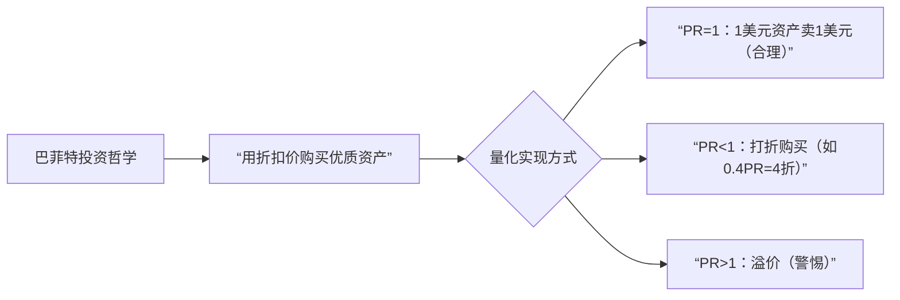
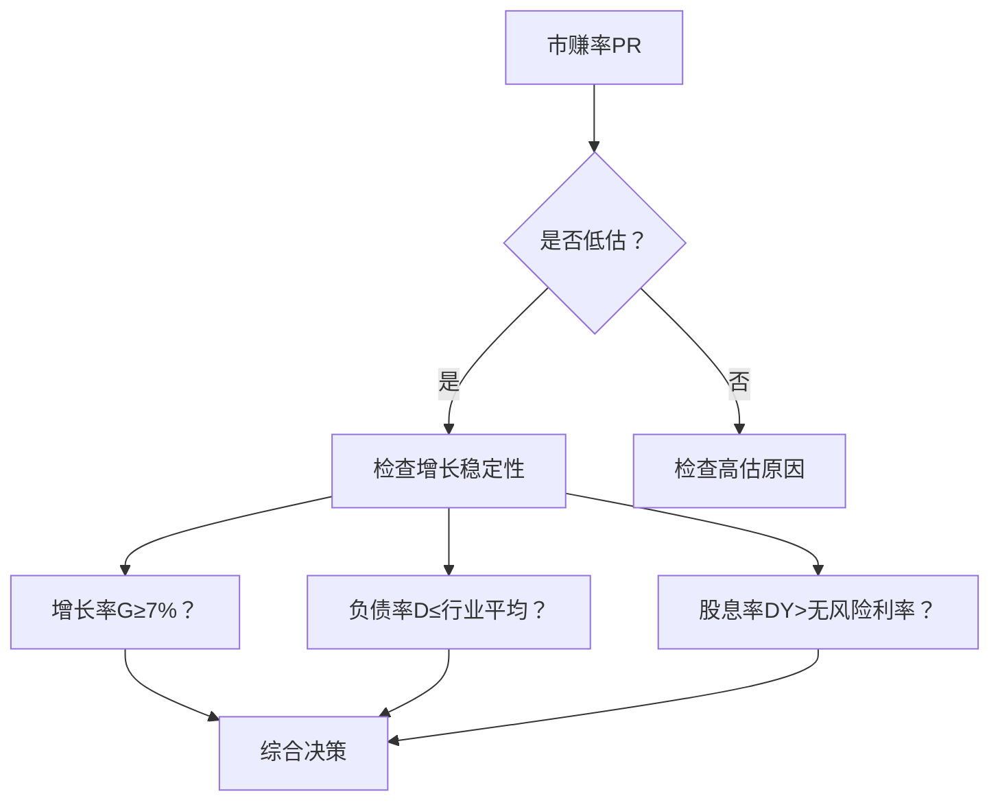
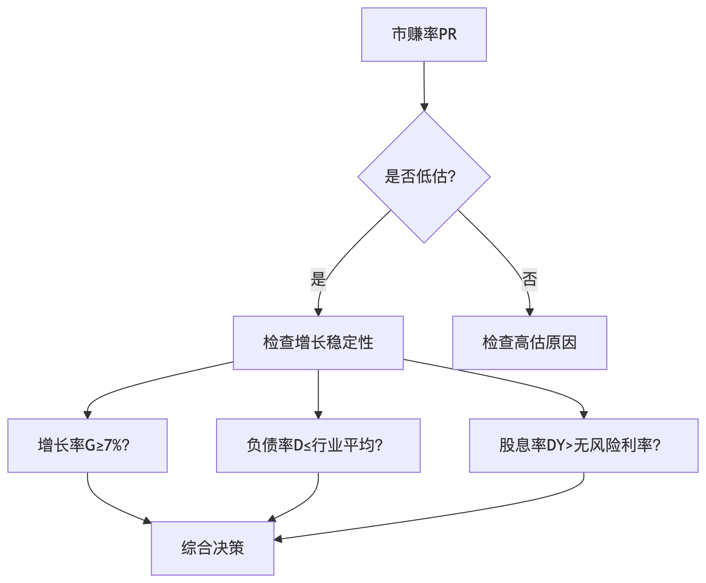
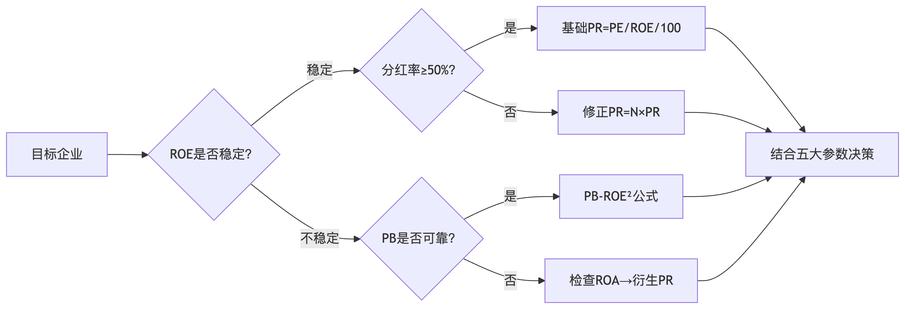

以下是市赚率公式逻辑体系及变体的结构化梳理，含核心逻辑、修正原理和应用边界备注：

---

### **一、底层逻辑框架**
#### **1. 核心思想**


#### **2. 数学本质**
- **基础公式推导**：  
  `PR = PE / ROE / 100`  
  ▸ **逻辑备注**：  
  - 分子`PE`（价格）反映市场情绪  
  - 分母`ROE`（盈利能力）锚定内在价值  
  - `/100`因ROE为百分比（如15%需转化为0.15参与计算）  
  - **物理意义**：获得1单位ROE需支付的PE倍数  

---

### **二、公式变体及修正逻辑**
#### **1. 分红率失真修正（N系数）**
| **公式**       | `修正PR = N × PR`<br>`N = 50% / 实际分红率` |
|----------------|---------------------------------------------|
| **触发条件**   | 比较**分红差异大**的价值股（如茅台vs招行）    |
| **修正逻辑**   | 解决“真钱分红溢价”现象：<br>- 高分红（≥50%）→ 市场给估值溢价 → 合理PE更高 → **N=1**（不调整）<br>- 低分红（≤25%）→ 需估值折价补偿 → **N=2**（PE门槛需砍半） |
| **案例验证**   | 茅台（分红50%，N=1，合理PE=30）<br>招行（分红33%，N=1.5，合理PE=10） |

#### **2. ROE波动修正（PB-ROE²公式）**
| **公式**       | `PR = PB / (ROE × ROE) / 100` |
|----------------|--------------------------------|
| **触发条件**   | ROE不稳定的**周期股/困境股**   |
| **修正逻辑**   | - 用`PB`（市净率）替代`PE` → 避免盈利波动干扰<br>- `ROE²` → 强化盈利能力权重（低ROE需更低PB） |
| **案例验证**   | 比亚迪（2008年）：<br>`PB=1.32, 历史ROE=16.07% → PR=0.51` |

#### **3. 财务结构失真修正（ROA替代）**
| **公式**       | `衍生PR = PE / (1.5 × ROA)` |
|----------------|------------------------------|
| **触发条件**   | ROE因**异常负债率**失真：<br>- 低负债→ROE虚低（如苹果）<br>- 高杠杆→ROE虚高 |
| **修正逻辑**   | - `ROA`（资产收益率）剥离杠杆影响<br>- `1.5`为经验系数（苹果ROE≈1.5×ROA） |
| **案例验证**   | 苹果（2024年）：<br>`PE=28, ROA=32% → 衍生PR=0.89 → 高利率环境减持` |

---

### **三、动态调整机制（五大隐形参数）**
#### **1. 参数交互逻辑**


#### **2. 关键参数备注**
| **参数**       | **逻辑作用**                  | **边界条件**                  |
|----------------|-----------------------------|-----------------------------|
| **利率(I)**    | 决定合理PR区间：<br>- 低利率→1.1-1.4PR<br>- 高利率→0.7-0.9PR | 10年期国债利率突破3%需重新校准 |
| **增长率(G)**  | 5折买入时：G≈7%可接受<br>全价买入时：G≈ROE/2 | 需用5年平滑增长率（防短期波动） |
| **ROE趋势(Δ)** | ROE升→容忍PR↑（1.2PR）<br>ROE降→需PR↓（0.8PR） | 连续3年趋势才有效              |

---

### **四、应用禁区与失效预警**
| **场景**         | **逻辑冲突**                  | **替代方案**          |
|------------------|-----------------------------|---------------------|
| **科技股**       | 盈利模式依赖创新，ROE不可预测   | PEG估值             |
| **衰退行业**     | 无ROE复苏基础（如报纸业）      | 资产清算模型        |
| **ROE>50%股**    | 通常含杠杆泡沫或会计失真       | 需用ROA衍生公式复核 |
| **分红率突变股** | 修正系数N失效（如周期股突击分红）| 禁用修正PR          |

> **核心公式选择流程图**  
> ```mermaid
> graph LR
>     A[目标企业] --> B{ROE是否稳定？}
>     B -->|稳定| C{分红率≥50%？}
>     C -->|是| D[基础PR=PE/ROE/100]
>     C -->|否| E[修正PR=N×PR]
>     B -->|不稳定| F{PB是否可靠？}
>     F -->|是| G[PB-ROE²公式]
>     F -->|否| H[检查ROA→衍生PR]
>     D & E & G & H --> I[结合五大参数决策]
> ```

此框架通过三层逻辑（基础公式→失真修正→动态校准）实现巴菲特的“模糊正确”，同时明确标注了每个变体的适用前提和失效边界，避免机械套用。