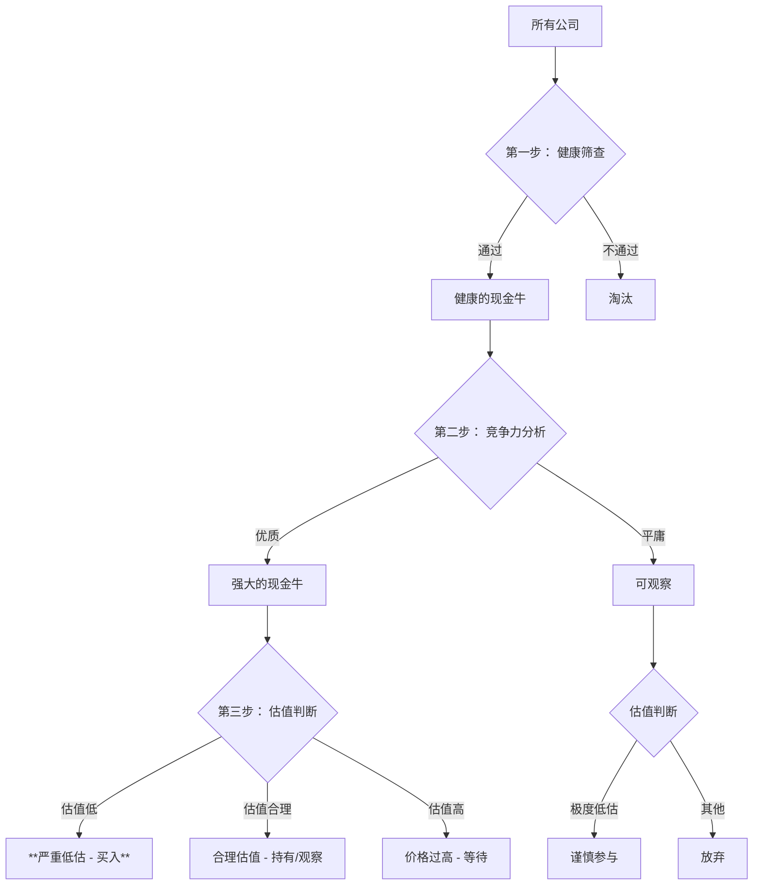

好的，完全理解。我们将整个分析过程提炼成一个**标准化、可重复使用的公式化、流程化模型**。

这个模型将以您提出的 **现金流ROCE** 为核心，结合其他关键指标，形成一个逐步筛选的“漏斗”，最终帮您系统性地判断企业是否被低估。

---

### **企业价值评估系统化模型**

#### **模型核心：现金流ROCE驱动**

**基石公式：**
**`现金流ROCE = 经营活动现金流量净额 / (股东权益 + 有息负债 - 现金及等价物)`**

**有息负债基础公式：**
**`有息负债 ≈ 短期借款 + 一年内到期的非流动负债 + 长期借款 + 应付债券`**

---

### **第一步：生存能力与盈利质量筛查（排除劣质公司）**

**目标：** 快速过滤掉盈利质量差、正在毁灭价值的公司。

| 步骤 | 指标与公式 | 合格标准 | 逻辑解读 |
| :--- | :--- | :--- | :--- |
| **1.1** | **现金流ROCE > 加权平均资本成本**   *（简化版：现金流ROCE > 10%）* | **> WACC 或 > 10%** | **价值创造门槛**。公司必须是一台“现金牛”，其核心业务产生的现金回报必须超过资本成本。 |
| **1.2** | **现金流ROCE > 净资产收益率**   `ROE = 净利润 / 股东权益` | **现金流ROCE ≥ ROE** | **盈利质量检验**。确保公司的利润有充足的现金支持，排除“纸上富贵”和财务操纵风险。 |
| **1.3** | **经营现金流/净利润 > 1**   *（利润现金比率）* | **> 1** | **盈利健康度**。这是对步骤1.2的强化验证，直接衡量每1元净利润能换来多少真实现金。 |

**结论：** 同时通过以上三步筛查的公司，可被视为 **“健康的现金牛”** ，进入下一轮分析。

---

### **第二步：竞争优势与趋势分析（识别优质公司）**

**目标：** 在健康公司中，找出拥有强大护城河和成长动力的强者。

| 步骤 | 指标与公式 | 合格标准 | 逻辑解读 |
| :--- | :--- | :--- | :--- |
| **2.1** | **现金流ROCE 5年趋势** | **稳定或向上** | **可持续性**。一个稳定或增长的ROCE表明公司的竞争优势在强化，而非被侵蚀。 |
| **2.2** | **与行业平均现金流ROCE对比** | **显著高于行业平均** | **相对竞争力**。证明公司拥有超越同行的商业模式、品牌、成本控制等护城河。 |
| **2.3** | **经营现金流增长率**   `(本期经营现金流 / 上期经营现金流) - 1` | **> 0，且与收入增长匹配** | **成长质量**。公司的现金流入正在增长，且不是以牺牲盈利能力为代价。 |

**结论：** 在本轮表现优异的公司，可被视为 **“强大的现金牛”** ，是潜在的优秀投资标的。

---

### **第三步：估值与安全边际判断（寻找买入时机）**

**目标：** 为这些优质公司估算一个合理的价值，并与当前市场价格比较，判断低估程度。

| 步骤 | 指标与公式 | 低估信号 | 逻辑解读 |
| :--- | :--- | :--- | :--- |
| **3.1** | **现盈率**   `现盈率 = 总市值 / 经营现金流净额` | **处于自身历史低位**   **或低于行业平均** | **现金估值视角**。这是市盈率的“现金版”，越低说明为每单位现金支付的价格越便宜。 |
| **3.2** | **市盈率**   `市盈率 = 总市值 / 净利润` | **处于自身历史低位**   **或低于行业平均** | **利润估值视角**。与现盈率结合，交叉验证市场的低估程度。 |
| **3.3** | **综合决策矩阵** | **参考下方矩阵** | 将前两步的结果进行最终合成，做出投资决策。 |

#### **最终决策矩阵**

将 **第一步和第二步的综合得分（公司质量）** 与 **第三步的估值水平** 放入以下矩阵：

| | **公司质量高**   (通过第一、二步筛选) | **公司质量低**   (未通过第一、二步筛选) |
| :--- | :--- | :--- |
| **估值低**   (现盈率/市盈率处于低位) | **【黄金买入区】**   **严重低估**。最佳投资机会，安全边际高。 | **【价值陷阱】**   看似便宜，但业务本质糟糕，应规避。 |
| **估值高**   (现盈率/市盈率处于高位) | **【暂缓买入区】**   好公司，但价格太贵。可加入观察列表，等待回调。 | **【坚决规避区】**   既差又贵，风险最高。 |

---

### **模型总结与应用流程**

您可以将这个模型可视化为一个清晰的流程图：

**如何使用这个模型：**

1.  **数据准备**： 收集目标公司至少5年的财务报表数据（利润表、资产负债表、现金流量表）。
2.  **逐步计算**： 严格按照模型中的公式，计算每一步的指标。
3.  **客观打分**： 根据“合格标准”为每个步骤打分，无情地淘汰不合格的公司。
4.  **最终决策**： 将最终幸存的公司放入“决策矩阵”，做出买入、持有或等待的决定。

这个模型的最大优势在于其**系统性和客观性**，它能有效地帮助你避免因“讲故事”而产生的投资冲动，专注于企业的基本面价值和真实现金流创造能力。